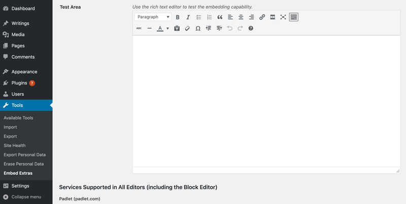

# Embed Extras WordPress Plugin

** by [cog.dog](https://cog.dog)

-----
*If this kind of stuff has any value to you, please consider supporting me so I can do more!*

 

----- 

## About and Why
This plugin  extends the variety of media sites whose content can be auto embedded by pasting a URL in the editor-- you know the way you can paste in the URL for any YouTube video and it automatically embeds in the editor (and when published).

If this is new to you, for your own sake, see [all the media sites WordPress supports natively](https://wordpress.org/support/article/embeds/). 

The Embed Extras plugin adds a few more into the mix.  Why bother with this?

1. HTML embed codes are messy. They have to be pasted into the text editor (WordPress running in Classic mode) or the HTML block.
2. Even if you can figure this out, it's all for naught if your site is hosted in a WordPress multisite (the iframe tags of most embed codes are stripped out)
3. It's much easier to paste in one URL and be done

## Caveats and Editors, Your Mileage Will Vary

Like many things, the WordPress Block editor introduced in WordPress 5, a.k.a "Gutenburg" (it's very name can launch family dividing arguments) makes things more... *complicated.*

A few of the sites will work everywhere meaning they will embed when a supported link is pasted in the editor and then RETURN/ENTER is pressed. These are lovely, but require the host site provides a funky API thing called [oEmbed support](http://oembed.com).

Many others will work, but need to be entered either in the Classic Editor or the WordPress 5 Classic Block (they will also work when entering content in one of the [SPLOT themes](http://splot.ca) I have created).

For now the plugin is very basic, it supports all the sites I have added code for. Grand dreams exist for a plugin options page where they could be toggled on or off, but the road down that path ended sadly.

It does feature an admin page where you can test out embeds.

## Supported Sites For All Editors

The following sites can be auto embedded from a URL and it works in any WordPress editor.

### Padlet (padlet.com)

All content published on Padlet can be automatically embedded by pasting in the URL for any published, public padlet content, for example `https://padlet.com/beckydono/48x1o4i4gi1s`

## Supported Sites For Classic Editors and SPLOTs

### H5P

H5P content (see http://h5p.org/) can be generated on many different sites, support for each must be added individually. Currently, this plugin supports

* H5P.com via URLs like: `https://lumenlearning.h5p.com/content/1290512849455705778`
* eCampusOntario's H5P Studio e.g.`https://h5pstudio.ecampusontario.ca/content/184`

### Internet Archive (archive.org)

Embeds support for Audio, Video, Texts, even their collection of software.

* `https://archive.org/details/atari_2600_frogger_1982_parker_brothers_ed_english_david_lamkins_pb5300`
* `https://archive.org/details/artofknitting00butt`
* `https://archive.org/details/Jolly_Fish_1932`
* `https://archive.org/details/AMFM2019-02-09`

## History

* Mar 16, 2020: First version (v1. committed
* Mar 7, 2020: The idea emerges and test version shared [It Takes More Magic Than a Saw to Support WordPress Media Embeds](https://cogdogblog.com/2020/03/magic-wordpress-media-embeds/) (CogDogBlog.com)

